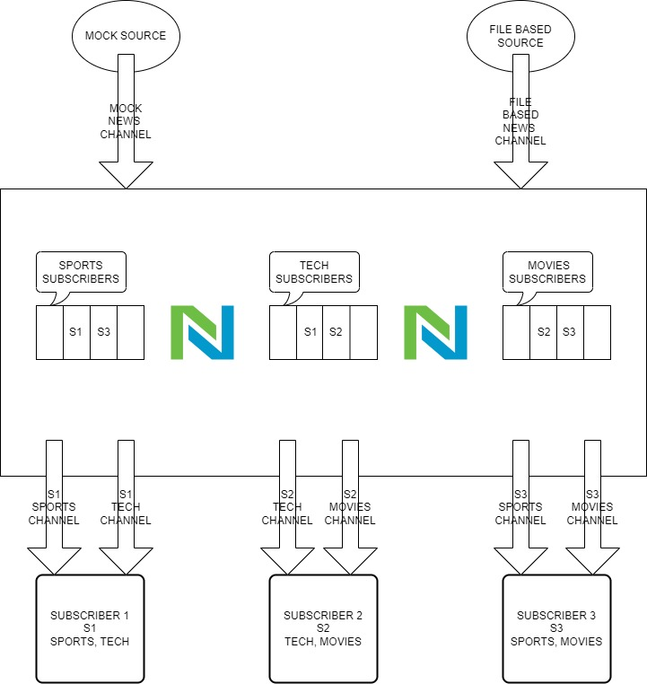

# **NewsService Design**



---

# ***Subscriber***

```
type Subscriber struct {
	name string
	sync.RWMutex
	topicChannel map[string]chan string
	cancel       context.CancelFunc
	closed       bool
	stopOnce     sync.Once
}
```
```
func NewSubscriber(name string) *Subscriber 
```

```
func (s *Subscriber) SubscriberStart(ctx context.Context, topics ...string) (context.Context, error)
```

```
func (s *Subscriber) Listen(ctx context.Context)
```

```
func readMsg(ctx context.Context, ch chan string)
```

```
func (s *Subscriber) GetChannelByTopic(topic string) chan string 
```

```
func (s *Subscriber) DeleteChannelByTopic(topic string) error 
```

```
func (s *Subscriber) IsClosed() bool 
```

```
func (s *Subscriber) SubscriberStop()
```

```
func GetSubscribers() ([]subscriber, error) 
```


