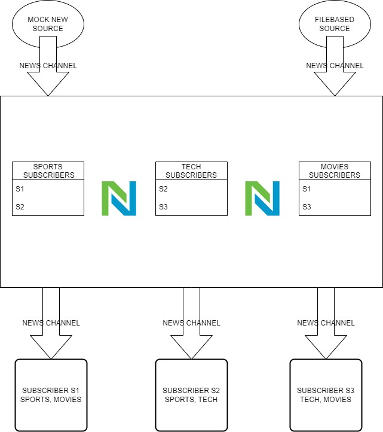

                        ** NewsService in Progress **


# **NewsService Design**



---

# ***Source***

```
type NewsSourcer interface {
	SourceStart(ctx context.Context, categories ...string)
	PublishArticles(ctx context.Context)
	SourceStop()
}
```

```
type source struct {
	Name       string   `json:"name"`
	FilePath   string   `json:"filepath"`
	Categories []string `json:"categories"`
}
```

```
type MockSource struct {
	name       string
	categories []string
	News       chan []Article
	sync.RWMutex
	Cancel   context.CancelFunc
	closed   bool
	stopOnce sync.Once
}
```

```
type FileBasedSource struct {
	name       string
	filePath   string
	categories []string
	News       chan []Article
	sync.RWMutex
	Cancel   context.CancelFunc
	closed   bool
	stopOnce sync.Once
}
```

```
type Article struct {
	Source      string
	Category    string
	Description string
}
```

# ***MockNewsSource***
```
NewMockSource(name string) *MockSource
```
```
(s *MockSource) SourceStart(ctx context.Context, categories ...string) context.Context
```
```
(s *MockSource) PublishArticles(ctx context.Context)
```
```
(ms *MockSource) getArticle() []Article 
```
```
(s *MockSource) SourceStop()
```

# ***FileBasedNewsSource***
```
NewFileBasedSource(name string, filePath string) *FileBasedSource
```
```
(s *FileBasedSource) SourceStart(ctx context.Context, categories ...string) context.Context 
```
```
(s *FileBasedSource) PublishArticles(ctx context.Context)
```
```
(s *FileBasedSource) GetArticles() []Article
```
```
(s *FileBasedSource) SourceStop()
```

# ***NewsSource***
```
type NewsService struct {
	sync.RWMutex
	ctx                 context.Context
	sources             map[string]interface{}
	subscribers         map[string]*Subscriber
	channelSubscriber   map[string]chan Article
	categorySubscribers map[string][]string
	newsArticles        *NewsArticles
	categoryArticles    *CategoryArticles
	newsStats           *NewsStats
	cancel              context.CancelFunc
	closed              bool
	stopOnce            sync.Once
}
```
```
type NewsArticles struct {
	newsArticles map[int]Article
}
```
```
type CategoryArticles struct {
	categoryArticles map[string]map[int]Article
}
```
```
type NewsStats struct {
	categories          []string
	backupFileLocation  string
	totalArticles       int
	articlesPerCategory map[string]int
	articlesPerSource   map[string]int
}
```
```
NewNewService() *NewsService
```
```
(news *NewsService) StartSubscribers() error
```
```
(news *NewsService) StartSources() error
```
```
(ns *NewsService) Start(ctx context.Context)
```
```
(ns *NewsService) listenForArticles(news chan []Article)
```
```
(ns *NewsService) publish(article Article) 
```
```
(ns *NewsService) saveArticleInMemory(article Article)
```
```
(news *NewsService) Subscribe(name string, topics ...string) 
```
```
(ns *NewsService) UnSubscribe(name string)
```
```
(ns *NewsService) saveArticlesInBackupFile() error 
```
```
(ns *NewsService) LoadArticlesFromBackupFile() error
```
```
(ns *NewsService) Stop()
```
```
func (ns *NewsService) NewsServiceStats()
```
# ***Subscriber***

```
type subscriber struct {
	Name   string   `json:"name"`
	Topics []string `json:"topics"`
}
```
```
type Subscriber struct {
	Name   string
	Topics []string
	Cancel context.CancelFunc
}
```
```
NewSubscriber(name string) *Subscriber 
```

```
(s *Subscriber) SubscriberStart(ctx context.Context, topics ...string) context.Context
```

```
(s *Subscriber) Listen(ctx context.Context, ch chan Article)
```

```
(s *Subscriber) readArticle(ctx context.Context, ch chan Article)
```

```
GetSubscribers(fileName string) ([]subscriber, error)
```


