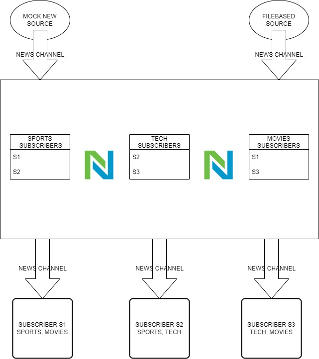

### **Name** : Naveen Reddy Kunareddy
### **Project** : News Service
### **Overview**  : At the core of the project is a news service. This service can have many subscribers listening to multiple news stories. The service will also have many sources for content.


# **NewsService Design**



## Install
```
mkdir ~/gopher_guides
cd ~/gopher_guides
git clone git@github.com:gosmartwizard/gopherguides-intro-to-go.git
git checkout week11
cd week11
go build -o news_service
```

## Run the tests
```
cd week11
go test -v -race -cover ./... -coverprofile=c.out -count=1
```

# Usage
```
./news_service
./news_service -h
```

## Stream

-f: File location of the backup file. A default should be provided.

-h: Prints the help message for the read sub-command.

-j: Prints the news stories in JSON format.

-o: File location to write the news stories to. If provided, no output should be printed to the console.
```
./news_service stream -h
```

```
cd week11
cp sampledata/newsarticles.json newsarticles/newsarticles.json
./news_service stream music sports politics
```
```
cd week11
cp sampledata/newsarticles.json newsarticles/newsarticles.json
./news_service stream movies tech 
```
```
cd week11
cp sampledata/newsarticles.json newsarticles/newsarticles.json
./news_service stream tech
```
```
cd week11
cp sampledata/newsarticles.json newsarticles/newsarticles.json
./news_service stream -f ./NewsServiceBackup.json -j -o ./stream.json sports
```
```
cd week11
cp sampledata/newsarticles.json newsarticles/newsarticles.json
./news_service stream -f ./NewsServiceBackup.json sports
```
```
cd week11
cp sampledata/newsarticles.json newsarticles/newsarticles.json
./news_service stream -j tech music
```
```
cd week11
cp sampledata/newsarticles.json newsarticles/newsarticles.json
./news_service stream -o ./stream.json music sports
```

## Read

-f: File location of the backup file. A default should be provided.

-h: Prints the help message for the read sub-command.

-j: Prints the news stories in JSON format.

-o: File location to write the news stories to. If provided, no output should be printed to the console.

```
./news_service read -h
```
```
./news_service read 1 2 3 4 5
```
```
./news_service read -f ./NewsServiceBackup.json 1 2 3 4 5
```
```
./news_service read -j 1 2 3 4 5
```
```
./news_service read -o ./articles.json -j -f ./NewsServiceBackup.json 1 2 3 4 5
```
```
./news_service read -o ./articles.json 1 2 3 4 5
```

## Clear
-h: Prints the help message for the clear sub-command.

-f: File location of the backup file. A default should be provided.
```
./news_service clear -h
```
```
./news_service clear
```
```
./news_service clear -f ./NewsServiceBackup.json
```
---


